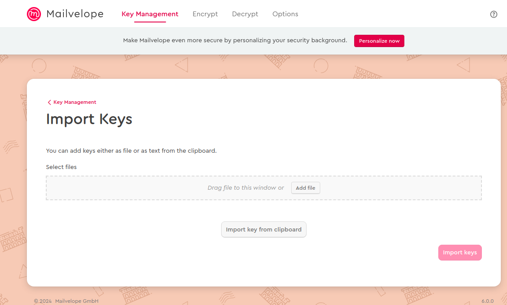
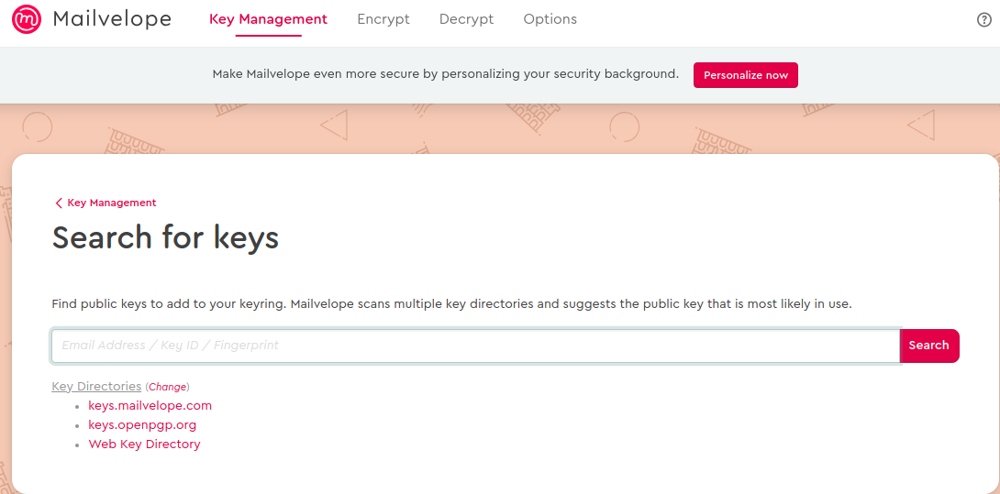
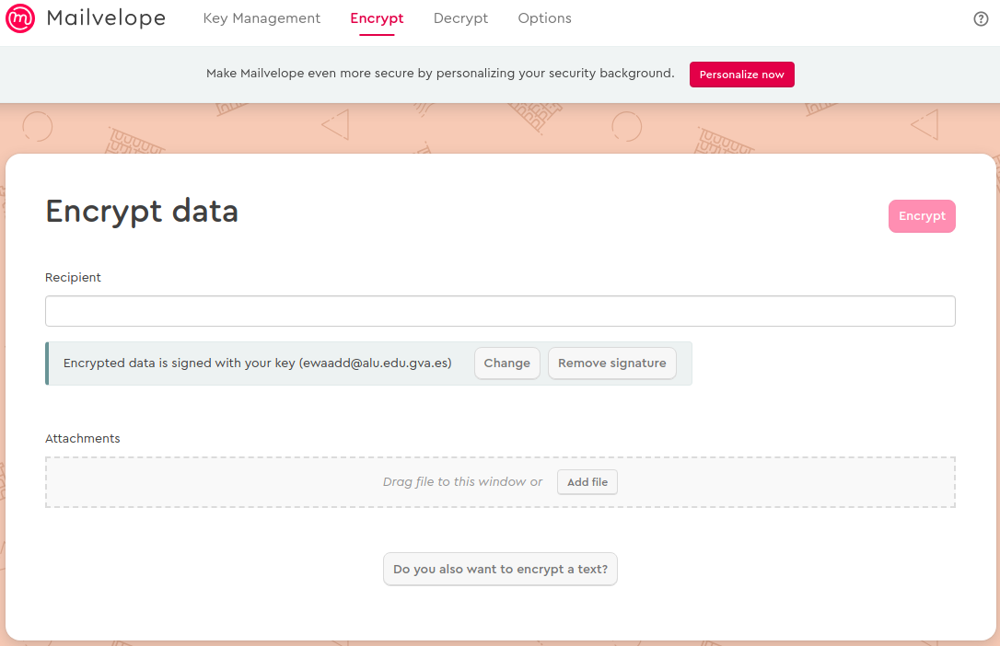
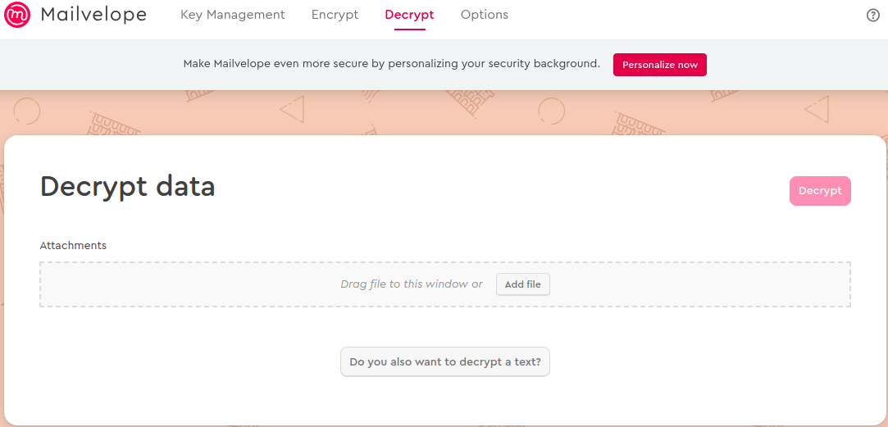

# Práctica 3a. GPG Pretty Good Privacy

## Contexto
El término criptografía proviene del griego *kyptós* 'oculto' y *grafé* 'escritura' y es definida como el arte de escribir con clave secreta o de un modo enigmático.

Gracias al uso de la criptografía se puede obtener una seria de ventajas de gran utilidad en el ámbito de la seguridad informáticfa como son:
* Confidencialidad
* Integridad
* Autenticidad
* No repudio
    

En esta práctica se trabajará sobre estos cuatro conceptos mediante la herramienta de comandos gpg (Pretty Good Privacy)

## Objetivos
* Entender la *confidencialidad, Integridad, Autenticidad* y no repudio mediante el uso de la herramienta *gpg*.
* Entender y poner en práctica la criptografía simetrica
* Entender y poner el práctica la criptografía asimétrcia
* Saber cifrar y descifrar mensajes mediante criptografía simétrica.
* Saber cifrar y descifrar mensajes mediante criptografía asimétrica.
* Saber firmar otras llaves generando así una relación de confianza entre usuarios de la comunidad.
* Ser capaces de firmar un documento y verificar que este ha sido firmado por quien dice ser.
* Ser capaces de importar/exportar claves a un servidor público
* Saber enviar correos cifrados y descifrar correos privados

## Desarrollo

 1. **Cifrar y descifrar un mensaje mediante criptografía simétrica**

Texto cifrado con forma simétrica, utilizando la contraseña "asir2".

```
bash echo "prueba de texto plano" | gpg --symetric --armour --batch --passphrase asir2
```
```
-----BEGIN PGP MESSAGE-----

jA0ECQMC3T6QHAVe/Rf/0jUBvKvL8e+BPD3RCC+yQjzg+T5SSlm2hSUtiZBagyos
nVPY8M+gQK6WyK/bhyJ6H6eGppfobg==
=23/V
-----END PGP MESSAGE-----

```
 2. **Crear par de claves**

```
gpg --full-gen-key
```

 3. **Listar claves pública/privada**

```
gpg --list-public-keys
```
```
ewaadd@aula082pc06:~$ gpg --list-public-keys 
/home/ewaadd/.gnupg/pubring.kbx
-------------------------------
pub   rsa3072 2024-11-19 [SC] [caduca: 2025-11-19]
      D04B68DA5089415C02CE513E4A0F8027282CD443
uid        [  absoluta ] Ewan Charles Addison <ewaadd@alu.edu.gva.es>
sub   rsa3072 2024-11-19 [E] [caduca: 2025-11-19]

```
```
gpg --list-secret-keys
```
```
ewaadd@aula082pc06:~$ gpg --list-secret-keys 
/home/ewaadd/.gnupg/pubring.kbx
-------------------------------
sec   rsa3072 2024-11-19 [SC] [caduca: 2025-11-19]
      D04B68DA5089415C02CE513E4A0F8027282CD443
uid        [  absoluta ] Ewan Charles Addison <ewaadd@alu.edu.gva.es>
ssb   rsa3072 2024-11-19 [E] [caduca: 2025-11-19]

```

 4. **Importar/exportar claves publicas y privadas**

```
gpg --import notario-private-key.asc 
```
```
gpg -a --export jorarrmon@alu.edu.gva.es 
```

```
ewaadd@aula082pc06:~$ gpg -a --export jorarrmon@alu.edu.gva.es 
-----BEGIN PGP PUBLIC KEY BLOCK-----

mQGNBGc8aukBDADODpQeRtVqGvLyLvHD0y0l5GsAR2IRJqNM4wkMTp9NtF00fEQ8
jO/npIw+WM12yWwltFX4mku7i1x8OuzJfZ9RhNhM6+flYt7nG9D4Fp4BFLPXyYc8
pRnOBzHBCYMKIiBHrCsnALk5Ghs1bLl6NHOySqT49563YqcU1ZnxibX8HU40/q36
ywn0lahoaT6NzmnwzmBzVKMhaiU+DUoLjaDlBJqEn/AMwPV+3Xf9d7DjNphbbEca
hrvn4Soax3TWZRsPpdISZhISvO9Vv7RKybPSdjcRKBKRCL50cBc+l1Wl1B5X3R8K
/0akw3hUSpJSEGD7fmom0Wv0YVP2T9L1x7Y7ef8aZxsLZHfCQ3zrO1kK9wseZx6u
Gyk2kQ9uHpu6j0cuK7L4JZhBMwxnJpqjsc46pul3NELdbfEcMN1crKitQrIhFnsU
2nT0UxNevWZLh616a2EoOj4kGET8Wbc+MoWJE3cF1iCgIHQfEiec4F5Kh1uhsLb+
6v+SFtwNM7HpoBUAEQEAAbQnSm9yZ2UgQXJyYW56IDxqb3JhcnJtb25AYWx1LmVk
dS5ndmEuZXM+iQHUBBMBCgA+FiEEoW7iAYjjYbkmEenDJJi+jRtVIs8FAmc8aukC
GwMFCQHhM4AFCwkIBwIGFQoJCAsCBBYCAwECHgECF4AACgkQJJi+jRtVIs/SbQwA
tPciPJ9XcHkAc9lstkP+4/xXk0OUaw0nU0yWgJJobSx1TrjvuXGt/WEF+Pngey6g
doam8Rl5FQPuMJU6djO1dAklxJ16+AzTqaLReIugNV6t9qcwYJ4ye47brF6YQT+k
4rGqX9Bsxwgw0KY6d7wNTidVqEmTKZOLqZbf00MJ3lmmD8JP+oCI2syvIRqUQez/
zRqxjVXzoS5qSgqzBhNrlmuvxiEWJakuquUvbb14JHz/eV8KiVM7KpwPYsxutvQx
EKo3VPW/QAOX3OGP15+NtuvLEgAlfHTtyXnFzgd3g7orIP7IRjyPRAdYD/vQf5aZ
aOtc0wAqFFkMwCMN+r/N+jJ7f43PSO+cr/sJdALnMZ4Qd4nMDzxck8kuX19p1tmo
TLgOVbVso3tjD6/Y2uYq0cMEXu7Fa/fPAZYpaKUuC5qBWGi8PzFS5dey4H5AcOde
2LX0vtBhT5B+WKgiyiCOlG2jKLqoyHRqG4D+8T1cARBFEUodxPZC9pyA7dqDxUtv
iQGzBBABCgAdFiEE0Eto2lCJQVwCzlE+Sg+AJygs1EMFAmc+4KIACgkQSg+AJygs
1EPUDwv/eNZWi+cEPEelc+ZdbrqtpnvKnbgxKhta4rIg5T85axhe2bAx6EvbGia+
VYgsdoqUoNbXOJ5s5Yh1fcu4ckqEe74ofsqdJmy/Ax18yWI8zl/aTFdZLvDVvBDF
4y+CPys6EVuIjCXvh+Xo0fX8516zQrXHqrDYmkhackr91Y0db3aEeSFTrcoLlKw7
6tsiy7bFKuWam3VAgr8Kk8PT95fn5DiNSlHU/ENgNb26V5SYAZJJO2ktZjTa0iri
timOaSkw1hQE1/99fw4JCs4h5HaLfwlKG8nKM/6R3691RiW89XrY0OqlprSvO3x0
dHk/kekwZgKZ6e0mKGOoGLv59VhRatLECwyervPcIFf94Jis21EbfoXukX03y+w/
kOCxrHupPklPKh80Mqg7/CRf3csuYS2i/zAyXqEQLTtukCQmzSvUD/8o9lyYvLei
Zb67KBfKr6pUEL53k6/GbaKuqDthukNoyfL/henrgiqdXHPSdO7P9R5pKX2rxKNg
jYQOJzvTuQGNBGc8aukBDACgEYipqtBZudGEaFX3mOAY5IEB/L5sjBm90udjl/bU
5tZH7dggo6zM41KNv0Mf30sFCEMX/8emhrpQcorWdOPqBEeu5i2ZRZBxGRyMoKMs
//dsmjIw+kGFhhjsNeVqsurk4sMmmaIUOVt15zXNl04xS7SZOpzaAO00ebxBhvVy
fEWYe2HdcDkaNv1lpEfxoMFGx9WSg6z1X324cbB0i0YVYR9l2jNT6UOizv8+GeoN
eRFLtyfjM6eJl1E3yBHS/JnEOLTVkaRjqvREZdd1sHMK74QliZ4pDoX57cuvLkhD
vm+/s9V0wqQ4DSit4qD4LqMqw+3uDxFyXFriCUERz3h67jcsbMtXAQSJvhX3lREH
W/2K5sLX2PizcVQUkEFfAfdTFkUKMPJfhq070x43p7mWK0Aj23zRdMZrLaaM3Slb
haXioJx8lHc/ih8/gqyeAq2stnDuEAtw/Utsw4ar9p7Dpg7MA096Q2SD9BDPTrqI
MdCrKC+jcIEPuWF41E4roYMAEQEAAYkBvAQYAQoAJhYhBKFu4gGI42G5JhHpwySY
vo0bVSLPBQJnPGrpAhsMBQkB4TOAAAoJECSYvo0bVSLPx7wL/i14KXmE/QHZ0Zw6
dThfpw0ktFV+NG82ZEfjA4+BoynJ6tzUdZvTxzag3XaIF2kkKsq0Eigp2TXP2eYc
mPBEJlknCEljFFqYNJFOa/oWu/TtcW7nMXsk+W2FtBk7+qVlW4tjHrwtX3Dxyjxc
BRu5Xk8U5voRCpkaXala4gXJ1tduhPd4Q5Kg3JX6iSHykNGfxltNBNvALpWybvQQ
4A4xTWb8+Fmq8FjKUwfsMuM33BgIcrwZCNvHJh5UYS06aXpsiL65/DE5ArrVZb4u
vxTXO9kyvtbaWGBNsaXBPzFQZbtD4zFuFG3z3l2RgxkoepANOzWuIhyB98QoyRAT
5+4d6K5Ro/Re5hehi8rWD+Zi1mJdYfE95HCl1tuKNcMc+750DTKI7KH9alOl114q
BGV2iPwOCxwXHamNRAQsRe2+C/nXy2E/18WGDs7RuIJUgrvm8Mn+SdvIkOVlhBll
5V5MmkSBEnn8BhZvVGYSn97PdIie7CNn54IjRwyNJwB37xoJ2w==
=6oIJ
-----END PGP PUBLIC KEY BLOCK-----

```

 5. **Importar y exportar de un servidor de claves**

```
gpg --keyserver keyserver.ubuntu.com --send-keys 282CD443
```

```
ewaadd@aula082pc06:~$ gpg --keyserver keyserver.ubuntu.com --send-keys 282CD443
gpg: enviando clave 4A0F8027282CD443 a hkp://keyserver.ubuntu.com
ewaadd@aula082pc06:~$ 

```

```
gpg --keyserver keyserver.ubuntu.com --receive-keys [KeyID/UID]
```

 6. **Encriptar un documento con clave pública de destinatario**

```
gpg --encrypt --recipient <UID/Clave publica receptor> <archivo a cifrar>
```

 7. **Desencriptar un documento cifrado con nuetra clave publica haciendo uso de clave privada**

``````
gpg --decrypt <archivo>
``````

 8. **Firmar un mensaje y verificar la autoria de un mensaje**

```
gpg --clear-sign <archivo>
```

```
gpg --verify <archivo>
```

 9. **Mailevelope**
    1.  Importar clave privada

      Ir a la página chrome-extension://kajibbejlbohfaggdiogboambcijhkke/app/app.html#/keyring/import y subimos el archivo o copiamos y pegamos la clave. 

     

    2.  Subir clave pública al keyserver de mailevelope

      En la misma página que utilizamos para import la clave pública (Mailvelope -> Key Management -> Importar), podemos subir un archivo que contiene la clave o copiar y pegar el texto de la clave a mano.

    3.  Importar claves publicas.

      Podemos importar un clave pública mediante, el motodo de importación, explicado anteriormnente o buscando la clave (Mailvelope -> Key Management -> Search)

       

    4.  Enviar un mensaje cifrado y descifrar mensaje.

      Para descifrar -> Mailvelope -> Decrypt, podemos o subir el archivo o copiar y pegar.

      Lo mismo seria para cifrar -> Mailvelope -> Encrypt.

      

      